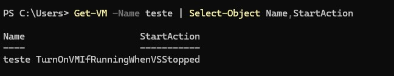

# Verificando e configurando Auto Start de VM


Ao gerenciar ambientes virtualizados com Hyper-V, é essencial garantir que as máquinas virtuais (VMs) iniciem automaticamente após uma reinicialização do host. Isso ajuda a manter a continuidade dos serviços e reduz a necessidade de intervenção manual.

Neste how-to, vamos trabalhar com o parâmetro `StartAction`, que define o comportamento de inicialização automática de uma VM. Esse parâmetro pode ser consultado e configurado via PowerShell, permitindo que você controle se a VM deve ou não ser iniciada automaticamente quando o host for ligado.

---

###  Benefícios de configurar o parâmetro StartAction

- **Alta disponibilidade**: Serviços hospedados nas VMs voltam a funcionar automaticamente após reinicializações.
- **Menos intervenção manual**: Evita que o administrador precise iniciar VMs manualmente após manutenção.
- **Padronização**: Facilita a gestão de ambientes com múltiplas VMs.

---

### Como verificar a configuração atual

Use o seguinte comando para listar o nome das VMs e sua configuração de inicialização:

```powershell
Get-VM | Select-Object Name,StartAction
```


para verificar uma VM especifica, basta utilizar a opção -Name (em nosso exemplo vamos procurar uma VM chamada "teste" )

```powershell
Get-VM -Name teste | Select-Object Name,StartAction
```
Esse comando vai retornar uma lista com o nome das VMs e configuração do StartAction


Caso queira exportar a lista das VMs, basta usar:

```powershell
Get-VM | Select-Object Name,StartAction | Export-Csv -Path "C:\VMs.csv" -NoTypeInformation -Encoding UTF8
```

A propriedade StartAction pode ter os seguintes valores:

`NeverAutoTurnOnVM`: A VM não será iniciada automaticamente.  
`AlwaysAutoTurnOnVM`: A VM sempre será iniciada automaticamente quando o host for ligado.  
`TurnOnVMIfRunningWhenVSStopped`: A VM será iniciada automaticamente apenas se estava em execução antes do host ser desligado.  

### Setar o parâmetro StartAction

```powershell
Get-VM -Name teste | Set-VM -StartAction TurnOnVMIfRunningWhenVSStopped
```



Recomendação: Usar `TurnOnVMIfRunningWhenVSStopped` é a opção mais segura, pois respeita o estado anterior da VM e evita iniciar máquinas desnecessariamente após uma reinicialização do host.

